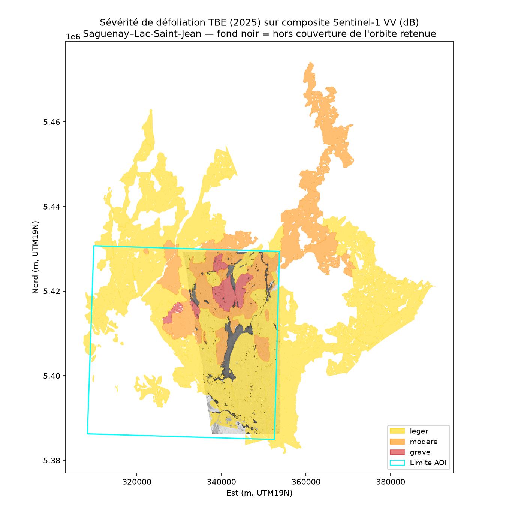
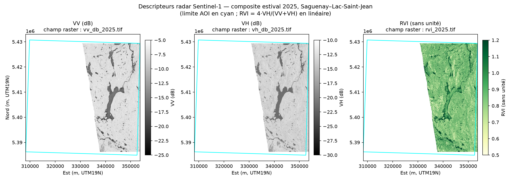
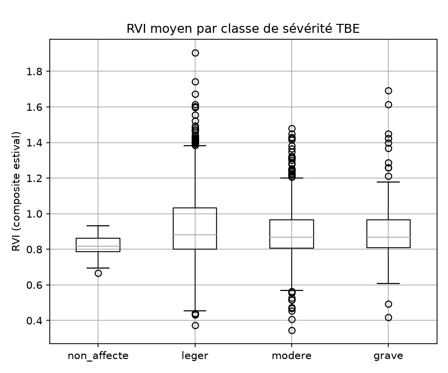
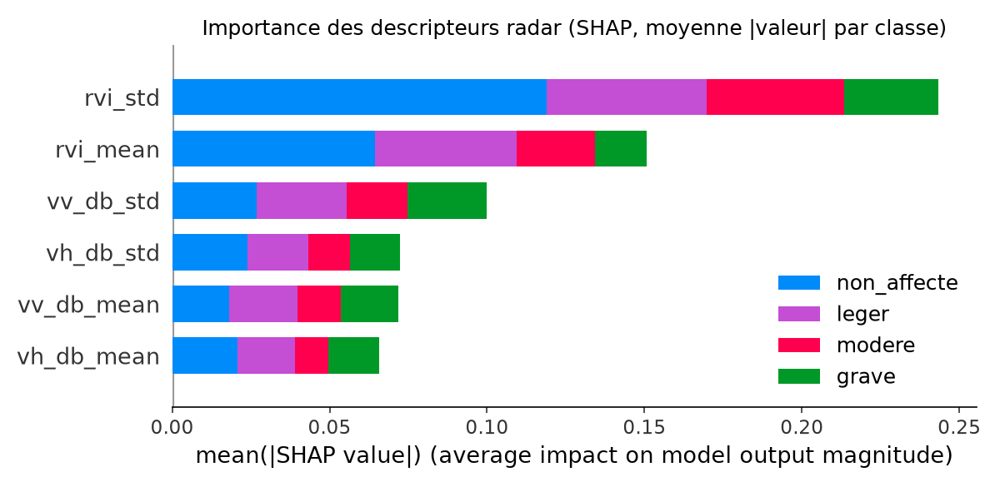
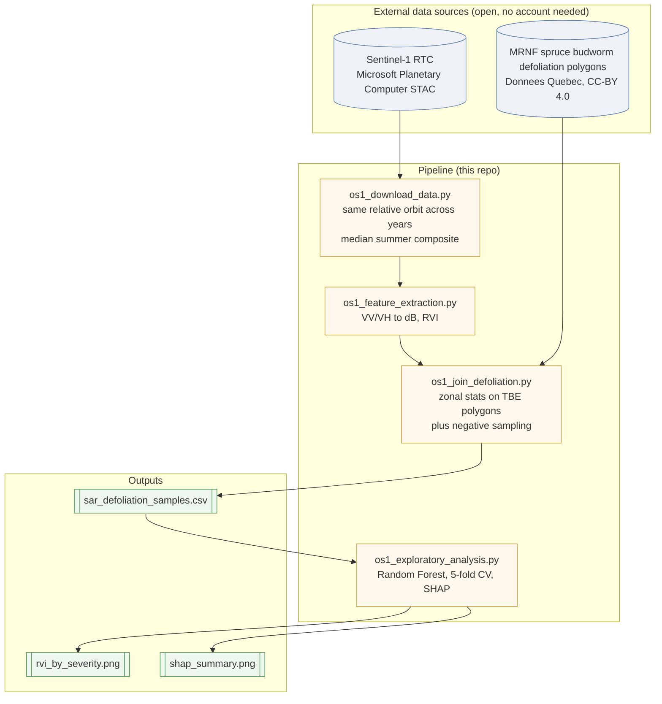
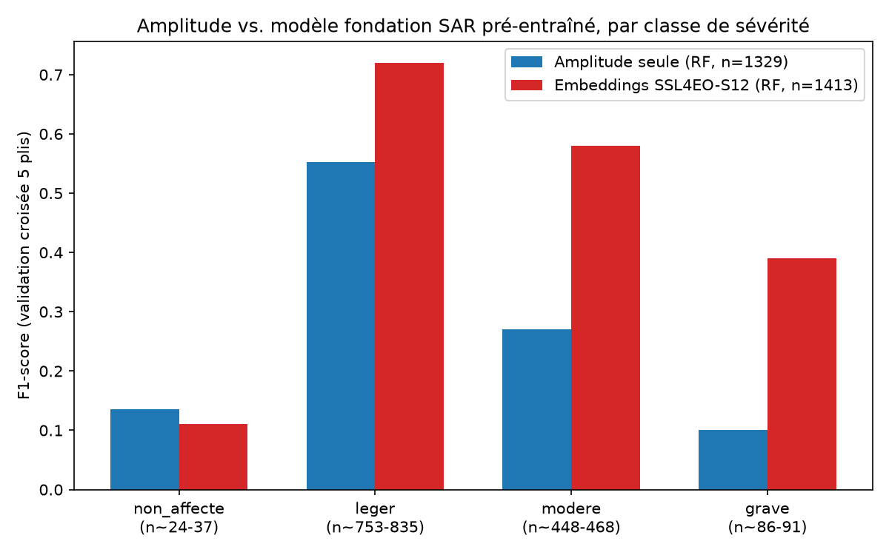
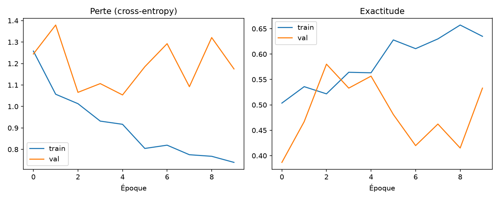
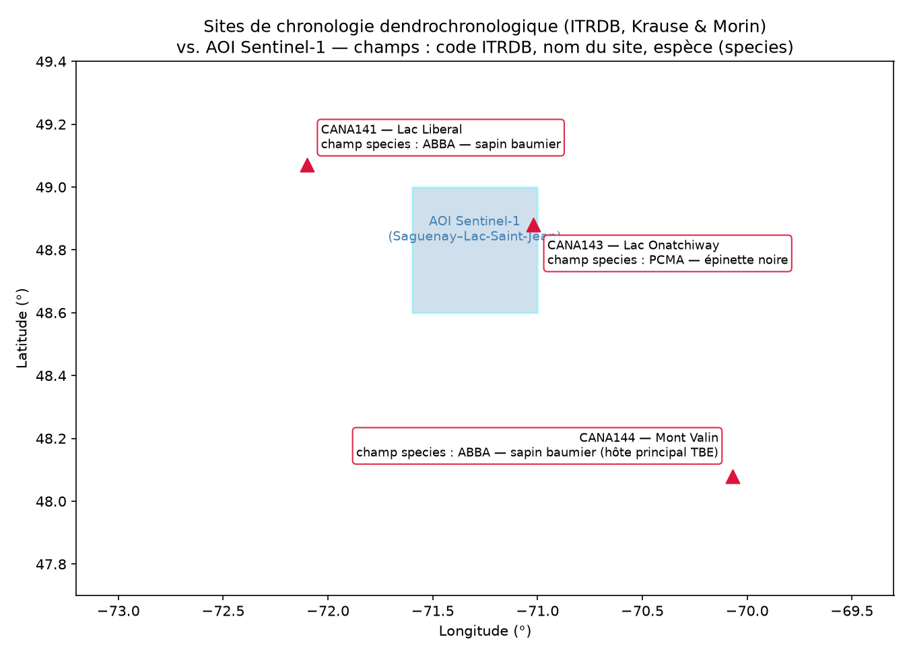
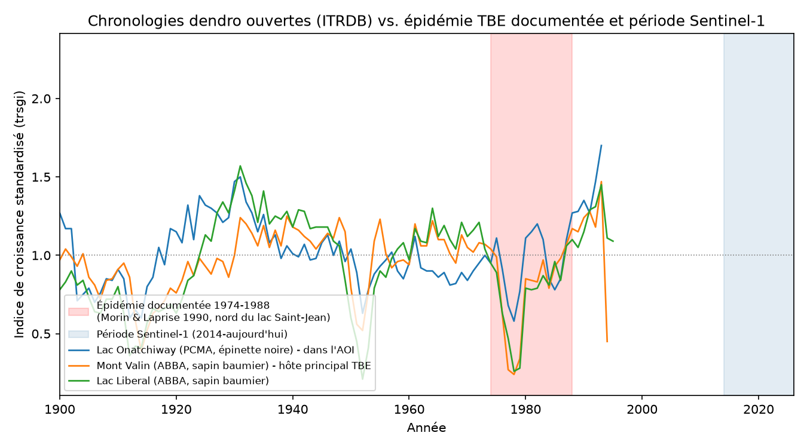
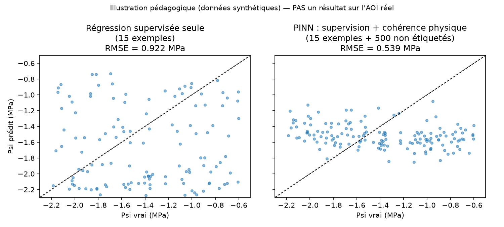

# SAR-TBE-Defoliation

**Does Sentinel-1 radar backscatter carry a usable signal of spruce budworm defoliation severity in the Canadian boreal forest?**

A reproducible, open-data-only pipeline that links Sentinel-1 SAR time series to the Quebec government's own aerial-survey defoliation maps, built as a proof-of-concept for a PhD research objective on SAR-based forest health monitoring.


---

## Table of contents

- [Motivation](#motivation)
- [Study area](#study-area)
- [Key result](#key-result)
- [Architecture](#architecture)
- [Data sources](#data-sources)
- [Methodology](#methodology)
- [Repository structure](#repository-structure)
- [Getting started](#getting-started)
- [Results & discussion](#results--discussion)
- [OS2 — first physical-model test](#os2--first-physical-model-test-negative-result-and-why-it-matters)
- [OS4 preview — a pre-trained SAR foundation model](#os4-preview--a-pre-trained-sar-foundation-model-changes-the-picture)
- [OS3 — dendrochronology](#os3--dendrochronology-what-open-data-can-and-cant-do)
- [Limitations](#limitations)
- [Illustrative aside — PINNs](#illustrative-aside--physics-informed-neural-networks-synthetic-data-not-an-aoi-result)
- [Roadmap](#roadmap)
- [License & data attribution](#license--data-attribution)
- [Author](#author)

## Motivation

Spruce budworm (*Choristoneura fumiferana*, "tordeuse des bourgeons de l'épinette", TBE) epidemics
periodically defoliate millions of hectares of balsam fir and spruce stands across the Quebec boreal
forest, with direct consequences for tree growth, mortality, and harvest planning. The Ministère des
Ressources naturelles et des Forêts (MRNF) has tracked this since 1967 through **annual aerial
surveys** — accurate, but costly, weather-dependent, and spatially discontinuous.

Sentinel-1 C-band SAR offers free, all-weather, 6-to-12-day revisit imagery over the entire province.
This repository asks a narrow, testable question: **does a simple, openly-computable radar descriptor
already correlate with the MRNF's own defoliation severity classes**, well enough to justify the more
ambitious physical modeling (Water Cloud Model / MIMICS inversion, dielectric coupling to tree
hydraulics) planned as the next phase of this research?

The entire pipeline runs on **open data only** — no proprietary imagery, no paid API, no local
processing software beyond a standard Python geospatial stack.

## Study area

Before any statistic, what does the actual damage look like on the ground? [`os1_severity_map.py`](os1_severity_map.py)
overlays the 2025 TBE severity polygons on the Sentinel-1 VV composite for the same year:

<p align="center">
  
</p>

The diagonal grayscale band is the actual Sentinel-1 swath on the retained orbit — visual confirmation
of the ~43–46% partial coverage noted in [Limitations](#limitations); outside it (black) there is no
SAR observation at all for this AOI/orbit. The TBE polygons themselves extend beyond the cyan AOI
boundary (bbox-intersecting polygons are kept in full, not clipped), giving a sense of how the
epidemic's real footprint compares to the small window this repo analyzes.

[`os1_sar_variables_map.py`](os1_sar_variables_map.py) shows the three raw descriptors side by side
instead of just their zonal statistics:

<p align="center">
  
</p>

## Key result

Across 5 summers (2017, 2019, 2021, 2023, 2025) and 1,329 zonal samples in the Saguenay–Lac-Saint-Jean
region, the dual-pol Radar Vegetation Index (RVI) **clearly separates defoliated from non-defoliated
stands**, but **does not cleanly separate the three severity classes** (light / moderate / severe) on
its own:

<p align="center">
  
  
</p>

A Random Forest classifier trained on 6 simple radar descriptors reaches 38% cross-validated accuracy
on the 4-class problem (chance ≈ 25–30% given class imbalance) — a real but modest signal, consistent
with the literature and with the expectation that **severity grading requires more than a linear radar
index** (see [Results & discussion](#results--discussion)).

*Caveat, established by the OS2 follow-up test below: part of this RVI separation appears to be a
spatial confound rather than a purely temporal defoliation response — see
[OS2 — first physical-model test](#os2--first-physical-model-test-negative-result-and-why-it-matters).*

## Architecture



Every stage is a standalone script driven by `config.py`, which centralizes the study area, the year
list, and the seasonal window — swapping the AOI is a matter of dropping a new shapefile in `data/shp/`
and setting one environment variable (`TBE_AOI`).

## Data sources

| Source | Provider | Access | License |
|---|---|---|---|
| Sentinel-1 RTC (gamma0, terrain-corrected) | ESA Copernicus, via [Microsoft Planetary Computer](https://planetarycomputer.microsoft.com/) STAC catalog | Remote windowed read, no account | Free & open (Copernicus data policy) |
| Spruce budworm defoliation polygons (`TBE_2014_2025`, 411,490 features, fields `ANNEE`/`Ia`/`Niveau`) | Ministère des Ressources naturelles et des Forêts (MRNF/MFFP), via [Données Québec](https://www.donneesquebec.ca/recherche/fr/dataset/donnees-sur-les-perturbations-naturelles-insecte-tordeuse-des-bourgeons-de-lepinette) | Bulk download (Esri File Geodatabase, ~1.2 GB) | CC-BY 4.0 |
| Tree-ring chronologies (CANA141/143/144, Krause & Morin) | [NOAA/NCEI World Data Service for Paleoclimatology, ITRDB](https://www.ncei.noaa.gov/products/paleoclimatology/tree-ring) | Direct file download (`.crn`, a few KB each) | Public domain (U.S. government data, cite investigators + NOAA landing page) |

No field data, no LiDAR, no commercial imagery — deliberately, to keep this proof-of-concept
reproducible by anyone with a laptop and an internet connection.

## Methodology

**1. Study area selection.** Four candidate boreal regions were queried live against the MRNF's ArcGIS
REST feature service (`DPF_WMS_TBE/MapServer`) for their 2025 defoliation severity mix. Saguenay–
Lac-Saint-Jean was retained: 453 polygons (316 light / 99 moderate / 38 severe) — the richest class
diversity of the four, in a documented epicenter of the current epidemic.

**2. Same-orbit compositing.** SAR backscatter depends on incidence angle, which varies by satellite
track. Comparing years acquired on *different* relative orbits would confound canopy change with
viewing-geometry change. `os1_download_data.py` therefore identifies the relative orbit with the best
multi-year coverage over the AOI and uses it for every year; within each year's 15 Jul–31 Aug window,
the 2–4 available scenes are combined with a **per-pixel median** (temporal despeckling).

**3. Radar descriptors.** For each yearly composite: `VV_dB`, `VH_dB` (10·log₁₀ of the linear gamma0),
and the dual-pol Radar Vegetation Index

```
RVI = 4 · VH / (VV + VH)
```

a normalized volume-scattering proxy expected to fall as a defoliated crown loses foliage (less volume
scattering, relatively more soil/branch contribution).

**4. Labeling.** Each year's MRNF defoliation polygons (`ANNEE`, `Ia` ∈ {1, 2, 3}) falling inside the
AOI are used directly as ground truth — no manual relabeling. A regular 1.5 km grid, restricted to
cells that don't intersect *any* TBE polygon that year, supplies "non-affected" (class 0) controls.

**5. Zonal statistics & modeling.** Mean and standard deviation of each descriptor are extracted per
polygon (`rasterstats`, reprojected to the raster's UTM CRS). A Random Forest classifier
(`class_weight="balanced"`, 5-fold stratified cross-validation) and a SHAP `TreeExplainer` quantify
which descriptors — and which moments (mean vs. intra-polygon variability) — carry the most signal.

## Repository structure

```
.
├── config.py                # AOI, years, season window, STAC endpoint, field names
├── os1_download_data.py         # Sentinel-1 RTC acquisition (same-orbit, median composite)
├── os1_feature_extraction.py    # VV_dB, VH_dB, RVI rasters
├── os1_join_defoliation.py      # zonal stats × TBE polygons + negative sampling → CSV
├── os1_exploratory_analysis.py  # Random Forest + SHAP, figures
├── os1_severity_map.py            # OS1: TBE severity polygons over the Sentinel-1 composite
├── os1_sar_variables_map.py       # OS1: VV/VH/RVI side-by-side maps
├── os3_dendro_sites_map.py        # OS3: ITRDB site locations vs. the AOI
├── os2_water_cloud_model.py       # OS2: single-angle Water Cloud Model calibration
├── os2_anomaly_correction.py      # OS2: per-pixel temporal-anomaly correction test
├── os2_texture_glcm.py            # OS2: GLCM texture descriptors
├── os2_combined_features.py       # OS2: fair matched amplitude-vs-texture comparison
├── os3_dendro_check.py            # OS3: nearest open ITRDB chronologies vs. documented outbreak
├── os4_foundation_model_probe.py  # OS4 preview: SSL4EO-S12 linear probing
├── os4_finetune.py                # OS4 preview: partial fine-tuning (layer4 + head)
├── requirements.txt
├── data/
│   ├── shp/                 # AOI definition (saguenay_lsj.shp) — versioned, ~20 KB
│   ├── tbe_raw/              # MRNF archive — gitignored, download separately (see below)
│   └── saguenay_lsj/
│       ├── raw/              # Sentinel-1 GeoTIFFs — gitignored, regenerate via os1_download_data.py
│       ├── processed/        # VV_dB/VH_dB/RVI rasters — gitignored, regenerate via os1_feature_extraction.py
│       └── results/          # sar_defoliation_samples.csv + figures — versioned
└── README.md
```

## Getting started

```bash
git clone https://github.com/mamadou-g-diallo/sar-tbe-defoliation.git
cd sar-tbe-defoliation
pip install -r requirements.txt

export TBE_AOI=saguenay_lsj

python3 os1_download_data.py        # Sentinel-1 RTC → data/<aoi>/raw/
python3 os1_feature_extraction.py   # VV_dB, VH_dB, RVI → data/<aoi>/processed/

# Download the MRNF archive manually (too large to version — see Data sources above),
# extract it under data/tbe_raw/, then:
python3 os1_join_defoliation.py     # → data/<aoi>/results/sar_defoliation_samples.csv
python3 os1_exploratory_analysis.py # → figures in data/<aoi>/results/
```

To run this on a different region: drop a new AOI polygon shapefile in `data/shp/`, set
`TBE_AOI=<name>`, and re-run the pipeline — no code changes required.

## Results & discussion

| Metric | Value |
|---|---|
| Years | 2017, 2019, 2021, 2023, 2025 |
| Valid zonal samples | 1,329 (753 light / 448 moderate / 91 severe / 37 non-affected) |
| Random Forest accuracy (5-fold CV, 4 classes) | 38% |
| Most contributive descriptor (SHAP) | `rvi_std` (intra-polygon RVI variability) |

The RVI cleanly separates non-affected stands (tight distribution around 0.80) from any level of TBE
damage (0.85–0.90 median), but the three severity classes overlap heavily with each other — a
detection signal, not yet a grading signal. This matches the broader SAR literature: single-index,
single-polarization descriptors are good at flagging *that* something changed in the canopy, but
*how much* typically needs either full polarimetric decomposition, InSAR coherence, or — the direction
this project is heading next — a physically-based scattering model that can be inverted rather than
just read off.

The SHAP analysis adds a concrete, unexpected(ish) lead: **intra-polygon RVI variability outranks the
RVI mean** as a predictor. A plausible reading is that within-stand structural heterogeneity (patchy
defoliation, canopy gaps) carries information that a single average value discards — a hypothesis that
airborne LiDAR structural metrics (canopy height variance, gap fraction) could test directly in the
next phase of this project.

## OS2 — first physical-model test (negative result, and why it matters)

As a first, deliberately quick test of OS2, [`os2_water_cloud_model.py`](os2_water_cloud_model.py)
fits a single-angle Water Cloud Model (Attema & Ulaby, 1978) to the same OS1 samples, estimating one
effective vegetation descriptor `V` per severity class jointly with shared coefficients `A`, `B`,
`σ0_soil` per polarization, by nonlinear least squares.

**Result: it doesn't work, and the reason is diagnostic.** The best possible 4-value-per-class model
caps out at R² ≈ 0.003 on both `VV_dB` and `VH_dB` (checked directly against the per-class means, not
just the WCM fit) — the raw single-polarization backscatter carries essentially **no** class-level
signal once averaged per polygon; the within-class standard deviation (3–9 dB) dwarfs any between-class
difference (<1 dB). This is not an optimizer failure; it holds for the *best achievable* discrete model.

This sharpens, rather than contradicts, the OS1 finding: the RVI's non-affected/affected separation
comes specifically from the **VH/VV ratio**, which cancels common-mode nuisance variance (local
incidence angle, general moisture, calibration) that dominates each raw band on its own across a
~2,000 km² AOI.

**Follow-up test.** Planetary Computer's `sentinel-1-rtc` collection ships no incidence-angle asset
(confirmed directly on the STAC item — only `vv`, `vh`, `tilejson`, `preview`). But since every year is
acquired on the same fixed relative orbit, incidence angle and static terrain effects are **constant
over time for a given pixel** — so [`os1_feature_extraction.py`](os1_feature_extraction.py) computes a
**per-pixel temporal anomaly** (this year's value minus that pixel's own 5-year mean) as a
geometry-correction proxy that doesn't require the missing band, and
[`os2_anomaly_correction.py`](os2_anomaly_correction.py) re-runs the diagnostic on it:

| | Raw | Anomaly-corrected |
|---|---|---|
| Intra-class std, VV/VH | 6.2 dB | 0.6–0.9 dB (−86 to −90%) |
| Class-mean R² ceiling, VV/VH/RVI | 0.003 / 0.003 / 0.012 | 0.006 / 0.004 / 0.003 |
| Random Forest accuracy (5-fold) | 38% | 41% |

The correction **works exactly as designed** — it strips 86–90% of the within-class noise from VV/VH,
confirming that incidence-angle/static-terrain effects (not defoliation) were the dominant source of
raw variance. But the class-mean ceiling stays essentially at zero either way, and RF accuracy only
inches up (+3 points). Tellingly, RVI — already a *ratio*, so partly self-normalizing against the very
effects the anomaly correction targets — loses almost all of its (modest) raw R² once that correction
is applied. Read together, this suggests the OS1 RVI separation was **partly a spatial-confound
artifact** (non-affected controls and TBE polygons don't just differ by defoliation, they also differ
by location) rather than a purely temporal defoliation response — an important caveat on the OS1 result
above, not just a footnote on OS2.

The practical implication for OS2 is now more specific than "correct for incidence angle": amplitude-
only descriptors (single or dual-pol backscatter level) appear to carry very little severity
information at this resolution and compositing scheme, corrected or not. The physically-motivated path
already planned — coupling a Water Cloud Model to field-measured canopy water content/hydraulics,
plus higher-order descriptors (polarimetric decomposition, InSAR coherence, texture) — is reinforced by
this negative result, not just still an option.

**Second follow-up test: GLCM texture.** [`os2_texture_glcm.py`](os2_texture_glcm.py) computes
gray-level co-occurrence texture (contrast, homogeneity, energy, entropy; distance 1, 4 orientations
averaged) directly on each polygon's pixels — a structural descriptor that doesn't require an
amplitude shift to detect a patchier, more heterogeneous defoliated canopy:

| | Amplitude (raw) | Amplitude (anomaly) | **Texture (GLCM)** |
|---|---|---|---|
| Best class-mean R² ceiling | 0.012 (RVI) | 0.006 | **0.040 (VH homogeneity)** |
| Random Forest accuracy (5-fold) | 38% | 41% | 35% (n=431, vs. 1,329 for amplitude) |

Texture's R² ceiling is **an order of magnitude higher** than any amplitude descriptor — homogeneity is
lower (canopy more heterogeneous) in severely defoliated stands, a physically sensible direction. But
its Random Forest accuracy is lower than amplitude's, mostly because GLCM needs a minimum patch size
(≥16 valid 20 m pixels ≈ 0.64 ha) to be numerically meaningful, which drops the usable sample from 1,329
to 431 — a smaller, size-biased subset, not a fair head-to-head comparison yet.

**Third follow-up test: a fair, matched comparison.** [`os2_combined_features.py`](os2_combined_features.py)
computes amplitude and texture on the *same* 431 polygons in a single pass (rather than two independent
samplings), then trains Random Forest on each feature set alone and combined:

| Feature set | Random Forest accuracy (same n=431) |
|---|---|
| Amplitude alone (6 descriptors) | **39.4%** |
| Texture alone (8 descriptors) | 34.6% |
| Amplitude + texture combined (14 descriptors) | 39.7% |

Once sample size is controlled for, amplitude alone is actually the **stronger** predictor, and
combining it with texture buys essentially nothing (+0.3 points). The earlier "texture's R² ceiling is
10× higher" reading was correct on its own terms but misleading as a comparison — it was partly an
artifact of the smaller, larger-polygon-biased sample texture requires, not of texture being more
informative. This is the kind of correction that matters more than either result on its own: **check
that two numbers you're comparing were computed on the same data before trusting the gap between them.**

## OS4 preview — a pre-trained SAR foundation model changes the picture

Every hand-crafted descriptor tried above (amplitude, incidence-angle-corrected amplitude, GLCM
texture, and their combination) tops out around 38–41% accuracy. Before concluding that ~40% is a hard
ceiling for open Sentinel-1 data on this problem, [`os4_foundation_model_probe.py`](os4_foundation_model_probe.py)
tests one more thing, pulled forward from the OS4 roadmap item: **linear probing** on
[SSL4EO-S12](https://arxiv.org/abs/2211.07044) — a ResNet50 pre-trained by self-supervised contrastive
learning (MoCo) on global Sentinel-1 VV/VH, via [TorchGeo](https://torchgeo.readthedocs.io/). The
backbone stays frozen (no fine-tuning); only a Random Forest is trained on its 2048-d embeddings, for
the same 64×64 px (1.28 km) patch centered on each polygon centroid.

| | Amplitude (RF) | **SSL4EO-S12 embeddings (RF)** |
|---|---|---|
| Overall accuracy | 38.3% | **64.0%** |
| F1 — léger | 0.553 | **0.72** |
| F1 — modéré | 0.270 | **0.58** |
| F1 — grave | 0.101 | **0.39** |

<p align="center">
  
</p>

This is not a majority-class trick: the gain concentrates exactly where amplitude was weakest —
distinguishing *moderate* from *severe* damage, not just detecting that something is wrong. The one
class that stays hard, non-affected controls (n≈24, unfiltered by ecoforest type), is hard for both
methods alike, which is reassuring rather than suspicious.

**Why trust this more than the earlier RVI false lead.** The OS2 anomaly test caught the RVI result
being partly a spatial confound because it only separated *affected vs. non-affected* — exactly the
split a location/land-cover artifact would produce. Here the improvement is *within* defoliated forest,
grading léger → modéré → grave, which a simple "this looks like a different place" shortcut can't
easily produce. The larger spatial context (1.28 km vs. a per-polygon zonal mean) plausibly helps for a
genuine reason too: an insect outbreak is a spatially patchy, spreading process, and neighborhood
context may carry real information about local outbreak intensity that a single polygon's own pixels
don't.

**What this doesn't settle**: the patch size wasn't matched to polygon size the way the
amplitude/texture comparison was, and a single train/test protocol (5-fold CV, same as everywhere else
in this repo) isn't a substitute for a held-out spatial block or year. But as a first look pulled
forward from OS4, it's the strongest result in this repository, and it reframes OS2/OS3's field-data
conclusion: physical modeling and field hydraulics remain the right long-term direction, but
representation learning on raw SAR appears to already recover signal that hand-crafted descriptors
were leaving on the table.

**Does fine-tuning do even better? Tested — no, not at this sample size.**
[`os4_finetune.py`](os4_finetune.py) unfreezes `layer4` + a new classification head (the rest of the
backbone stays frozen) and trains on a 70/15/15 stratified split with class-weighted cross-entropy and
flip/rotation augmentation (valid for SAR — no canonical orientation):

<p align="center">
  
</p>

Training loss falls steadily; validation loss drops for ~4 epochs, then climbs while accuracy gets
noisy — textbook overfitting on ~989 training patches against a 25M-parameter unfrozen block. Early
stopping recovers the epoch-5 checkpoint: **59.9% test accuracy** (n=212, single held-out split) versus
**64.0%** for the frozen linear probe (5-fold CV, n=1413) — the fine-tuned model doesn't clearly beat
the simpler approach, and the two numbers aren't even on a fully comparable footing (one hold-out split
vs. cross-validated). At this sample size, treating the pre-trained embeddings as fixed and training
only a lightweight classifier on top is not just cheaper — it appears to be the better choice.
Fine-tuning would likely need substantially more labeled samples (or heavier regularization / a
smaller unfrozen block) to pay off, which is worth keeping in mind for OS4 once new field data grows
the training set.

## OS3 — dendrochronology: what open data can and can't do

[`os3_dendro_check.py`](os3_dendro_check.py) pulls the three nearest published tree-ring chronologies
(NOAA/[ITRDB](https://www.ncei.noaa.gov/products/paleoclimatology/tree-ring), Krause & Morin) to the
AOI — one (Lac Onatchiway, black spruce) falls *inside* the Sentinel-1 bounding box; the other two
(Mont Valin, Lac Liberal — balsam fir, TBE's primary host) are within the same region —
[`os3_dendro_sites_map.py`](os3_dendro_sites_map.py) plots exactly where:

<p align="center">
  
</p>

**The hard limit, stated plainly**: all three end in **1993–1995**, roughly two decades before Sentinel-1
existed (2014+). Open dendro data cannot directly validate the SAR-derived index from this repo — that
requires new field coring co-located with current SAR observations, which is exactly what OS3 is
scoped to do in the full research plan.

What these chronologies *can* do, and do well: corroborate that they capture a real, known regional
signal, which is a meaningful check on data quality before investing in new fieldwork guided by the
same sites/species.

<p align="center">
  
</p>

All three independent chronologies hit their growth minimum in the **same year, 1978**, within the
epidemic window documented specifically for this region by Morin & Laprise (1990) — synchrony across
independent sites that rules out chance. The *magnitude* tracks host preference exactly as entomology
predicts: balsam fir (the primary TBE host) drops 77–78% from its pre-outbreak level, black spruce (a
minor host) only 35%. Old data, but a real, physically coherent, cross-validated signal — a solid basis
for planning where new coring would be most informative.

## Limitations

- Only 2–4 Sentinel-1 scenes per yearly composite; no dedicated spatial speckle filter beyond the
  temporal median.
- Non-affected controls are sampled by a blind regular grid, not filtered against an ecoforest map —
  they may include non-coniferous stands.
- Sentinel-1 coverage of the chosen AOI is partial (~43–46%): the retained orbit's swath doesn't cover
  the full bounding box.
- Incidence angle varies along-swath within a single orbit (not corrected here).

These are accepted trade-offs for a data-open proof-of-concept, not fundamental barriers — each has a
concrete fix identified for the next phase (see below).

## Roadmap

This is OS1 (Objectif Spécifique 1) of a four-part doctoral research plan:

- **OS1 (this repo)** — characterize the SAR signal against defoliation severity.
- **OS2** — four tests run so far (this repo): a single-angle Water Cloud Model, a per-pixel
  temporal-anomaly correction standing in for the missing incidence-angle band, GLCM texture, and a
  matched amplitude-vs-texture-vs-combined comparison. None of amplitude, texture, or their combination
  clears ~40% accuracy on open data alone — the ceiling isn't a missing descriptor, it's the missing
  physical/field layer. Next: couple a Water Cloud Model to field-measured tree water potential/sap
  flow via a dielectric mixing model, and add InSAR coherence once SLC pairs are worth acquiring — the
  SNAP GPT chain to compute it is ready ([`insar_coherence_snap/`](insar_coherence_snap/), adapted from
  the pipeline used operationally for post-earthquake coherence mapping); acquiring authenticated SLC
  data for this AOI is the remaining blocker, not the processing method.
- **OS3** — a first check (this repo) against the 3 nearest open ITRDB chronologies confirms they
  capture a real, host-specific 1978 growth crash synchronized across independent sites, but all three
  end in 1993–1995 — decades before Sentinel-1 exists. Cross-validating the SAR-derived stress index
  requires new field coring (ring width, blue intensity) co-located with current SAR observations, not
  a reuse of legacy chronologies.
- **OS4** — linear probing on SSL4EO-S12 embeddings (this repo) already outperforms every hand-crafted
  descriptor (64.0% vs. 38–41% accuracy, gains concentrated in the léger/modéré/grave grading that
  amplitude and texture couldn't do); partial fine-tuning was tested too and overfits at this sample
  size (59.9%, worse than the frozen probe) — more labeled data would likely be needed before
  fine-tuning pays off. Next: test transferability across regions/years, and package an operational
  severity index for forest harvest planning.

## Illustrative aside — physics-informed neural networks (synthetic data, not an AOI result)

The OS2 roadmap item (couple a Water Cloud Model to field-measured tree hydraulics) is a natural fit
for a **physics-informed neural network** (PINN): an encoder that inverts tree water potential (Psi)
from SAR backscatter, regularized by a differentiable physics decoder rather than relying solely on
scarce field labels. But testing one on the real AOI right now would show nothing — the WCM test above
already established that the physics itself carries ~zero signal in *this* open dataset, because the
real state variables (measured canopy water content, local incidence angle) aren't available. A PINN
cannot inject physical information that isn't in the data.

[`os2_pinn_illustration.py`](os2_pinn_illustration.py) instead demonstrates *what the approach would
buy once real field hydraulics exist*, on synthetic data with literature-typical (not calibrated, not
real) parameters: 500 synthetic samples run through Psi → canopy moisture (logistic pressure-volume
curve) → the same Water Cloud Model equations → noisy SAR backscatter, of which only **15** carry a
"known" Psi label — a realistic size for a first field campaign.

<p align="center">
  
</p>

| | RMSE on Psi (MPa), same 15 labels |
|---|---|
| Supervised regression alone | 0.922 |
| PINN (+ physics-consistency loss on all 500 unlabeled samples) | **0.539** |

The physics-consistency term — computable on *all* samples without knowing their Psi, since it only
checks that predicted Psi reconstructs the observed backscatter through the known equations — cuts
error by ~40% from the same 15 labels. It's not a clean inversion (the scatter is still wide, and the
toy pressure-volume curve saturates at both ends, which is a genuine identifiability limit of this kind
of inverse problem, not an artifact of the neural network): the honest takeaway is that physics
regularization helps when labels are scarce, not that it solves the inversion outright. This is a
worked illustration for the thesis proposal, not a finding about the Saguenay–Lac-Saint-Jean forest.

## License & data attribution

Code in this repository is released under the [MIT License](LICENSE).

- Sentinel-1 data: © Copernicus Sentinel data, processed by Microsoft Planetary Computer — free and
  open under the EU Copernicus data policy.
- Defoliation data: © Ministère des Ressources naturelles et des Forêts du Québec, via
  [Données Québec](https://www.donneesquebec.ca/recherche/fr/dataset/donnees-sur-les-perturbations-naturelles-insecte-tordeuse-des-bourgeons-de-lepinette),
  licensed [CC-BY 4.0](https://creativecommons.org/licenses/by/4.0/).

## Author

**Mamadou Galy Diallo** — [galy.quantum@gmail.com](mailto:galy.quantum@gmail.com) ·
[github.com/mamadou-g-diallo](https://github.com/mamadou-g-diallo)

M1 Calcul Haute Performance et Simulation, Université de Perpignan Via Domitia · M2 Télédétection-SIG,
CRASTE-LF. Built as a proof-of-concept ahead of a PhD application on SAR-based boreal forest health
monitoring (Université du Québec à Trois-Rivières / MRNF).
