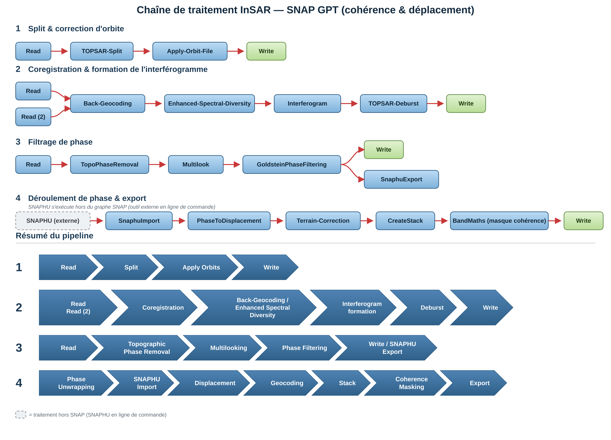

# Cohérence interférométrique Sentinel-1 (SNAP GPT)

Chaîne de calcul de cohérence InSAR par lots, sur une série temporelle de
produits SLC Sentinel-1. **Séparée du reste de ce dépôt** : elle utilise
[ESA SNAP](https://step.esa.int/main/download/snap-download/) (Java,
installation locale requise), pas la pile Python/rasterio du pipeline
principal.

## Origine et contexte

Nettoyé et documenté à partir du graphe et du script utilisés
opérationnellement à l'UM6P (dans le cadre du poste Remote Sensing & GIS
Engineer, sept. 2023 – mars 2025) pour cartographier la cohérence et le
déplacement du sol suite au **séisme d'Al Haouz** (Maroc, 8 septembre 2023),
à la demande du responsable du laboratoire.

Repris ici pour deux raisons :
1. le rendre réutilisable sans ambiguïté (noms de nœuds explicites, paramètres
   externalisés au lieu d'être codés en dur, choix méthodologiques commentés) ;
2. fournir l'outil qui manquait à l'exploration de la cohérence InSAR pour la
   défoliation TBE (cf. section OS2 du README principal) — dès que des paires
   SLC sur l'AOI Saguenay–Lac-Saint-Jean sont disponibles (l'acquisition ASF
   avait été mise en pause, cf. historique du projet), cet outil calcule la
   cohérence sans dépendre d'une librairie tierce non vérifiée.

## Chaîne de traitement

```
Read (x2, master+esclave)
  -> Apply-Orbit-File (orbites précises, téléchargement automatique)
  -> TOPSAR-Split (IW1, IW2, IW3 — x2 images chacune)
  -> Back-Geocoding (coregistrement, DEM SRTM 3 arcsec)
  -> Coherence (fenêtre 2 az. x 10 rg., par sous-fauchée)
  -> TOPSAR-Deburst (par sous-fauchée)
  -> TOPSAR-Merge (fusion IW1+IW2+IW3)
  -> Terrain-Correction (géocodage WGS84, ~14 m)
  -> Write (GeoTIFF)
```

<p align="center">
  
</p>

Les blocs 1 à 3 du schéma correspondent à la chaîne ci-dessus (découpée par étape
logique : split/orbite, coregistrement/interférogramme, filtrage de phase). Le
bloc 4 (déroulement de phase, SNAPHU → déplacement → géocodage) est
**l'extension prévue et non encore implémentée** décrite dans la limite
ci-dessous — il ne fait pas partie de `run_coherence_batch.py` aujourd'hui.

## Limite méthodologique assumée

Le graphe calcule une cohérence **sans retrait de la rampe de phase**
(`subtractFlatEarthPhase=false`, `subtractTopographicPhase=false`). C'est
suffisant pour une carte de cohérence (détection de changement de surface),
et c'est le produit que ce graphe a été conçu pour fournir en lot sur une
série temporelle complète. **Ce n'est pas suffisant pour extraire un
déplacement en ligne de visée (LOS)** à partir de la phase : cela demande en
plus le déroulement de phase (SNAPHU) et la conversion géométrique LOS, non
inclus ici et généralement fait au cas par cas sur la paire d'intérêt plutôt
qu'en lot.

Autre limite : sans retrait de la rampe de phase, la cohérence peut être
légèrement sous-estimée dans les zones à fort relief ou grande ligne de base
(décorrélation géométrique confondue avec une vraie décorrélation temporelle)
— pertinent pour un relief marqué comme l'Atlas, moins pour une zone plane.

## Prérequis

- [ESA SNAP](https://step.esa.int/main/download/snap-download/) avec le
  module Sentinel-1 Toolbox installé, exécutable `gpt` accessible (sur le
  `PATH`, ou fourni via `--gpt-path`)
- Accès Internet (téléchargement automatique des orbites précises et du DEM
  SRTM au premier lancement)
- Python 3 (script de lancement uniquement — aucune dépendance externe)

## Utilisation

```bash
python3 run_coherence_batch.py \
    --input-dir /chemin/vers/SLC/ \
    --output-dir /chemin/vers/sortie/ \
    --burst-first 1 --burst-last 9
```

Génère une cohérence VV pour chaque **paire consécutive** de la série
temporelle triée par date (stratégie standard pour un suivi de cohérence
dans le temps). Reprise automatique : une paire déjà calculée (fichier de
sortie déjà présent) est sautée.

Pour vérifier les paires et commandes générées sans exécuter SNAP :
```bash
python3 run_coherence_batch.py --input-dir ... --output-dir ... --dry-run
```

### Variante double polarisation (VV + VH)

[`coherence_graph_vv_vh.xml`](coherence_graph_vv_vh.xml) +
[`run_coherence_batch_vv_vh.py`](run_coherence_batch_vv_vh.py) calculent la
cohérence VV **et** VH en une seule passe (`selectedPolarisations=VV,VH` sur
les nœuds `Split`/`Deburst`/`Merge` — pas besoin de dupliquer la
coregistration, qui ne dépend pas de la polarisation) :

```bash
python3 run_coherence_batch_vv_vh.py \
    --input-dir /chemin/vers/SLC/ \
    --output-dir /chemin/vers/sortie/ \
    --burst-first 1 --burst-last 9
```

Sortie par paire : `Coherence_VV_VH_{d1}_{d2}.tif` (2 bandes : VV puis VH) et
`Coherence_ratio_VHVV_{d1}_{d2}.tif` (ratio VH/VV, calculé en Python via
rasterio — même logique que le RVI du pipeline principal, qui n'est pas non
plus calculé dans SNAP). Motivation : VH est plus sensible à la diffusion de
volume (houppier) que VV, donc potentiellement plus diagnostique d'une
défoliation — cf. discussion dans le README principal. Dépendance
supplémentaire par rapport au script VV seul : `rasterio` (déjà utilisé par
le pipeline principal). Ajouter `--no-ratio` pour ne garder que la sortie
SNAP brute.

### Trouver la plage de bursts (`--burst-first`/`--burst-last`)

Dépend de l'AOI et doit être redéterminée pour chaque nouvelle zone d'étude :
ouvrir un des produits SLC dans SNAP Desktop (Graph Builder ou simple
ouverture), afficher la sous-fauchée concernée, et lire les index de burst
qui couvrent l'AOI dans le panneau d'information du produit — ou utiliser
`TOPSAR-Split` en mode interactif une fois pour identifier visuellement la
plage avant de la réutiliser en lot.

## Fichiers

- [`coherence_graph.xml`](coherence_graph.xml) — graphe SNAP GPT, VV seule
  (paramètres : `InputFile1`, `InputFile2`, `OutputFile`, `BurstFirst`,
  `BurstLast`)
- [`run_coherence_batch.py`](run_coherence_batch.py) — script de lancement en
  lot sur une série temporelle SLC (VV seule)
- [`coherence_graph_vv_vh.xml`](coherence_graph_vv_vh.xml) — variante double
  polarisation VV+VH (mêmes paramètres)
- [`run_coherence_batch_vv_vh.py`](run_coherence_batch_vv_vh.py) — script de
  lancement correspondant, avec calcul du ratio VH/VV en post-traitement
- [`schema_InSAR.png`](schema_InSAR.png) — schéma du pipeline (graphes GPT +
  résumé), blocs 1-3 implémentés ici, bloc 4 (déroulement de phase) à venir
